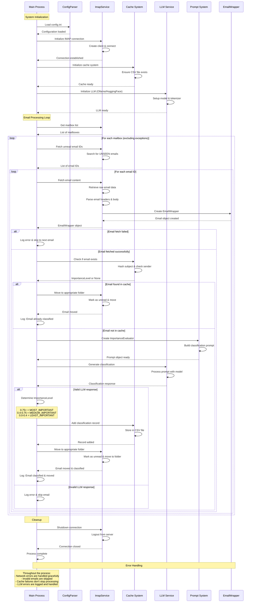

# Mailbot-9000

An intelligent email management system that automatically classifies incoming emails by importance level using local LLM models (ollama api) and organizes them into appropriate folders.

## Features

- **Automated Email Classification**: Uses passed in config to classify email in three categories: highly important (must be seen), medium important (should be seen; but later), low important (can be seen at spare time)
- **IMAP integration**: This is primarly designed for iCloud as Apple's iCloud email does not provide a lot of features. 
- **Caching**: Uses a local `.csv` file to store already seen emails making less calls to `llm model`
- **Configurable**: Manages everything through `.config` files

## Prerequisites

- Python 3.9 or higher
- For Ollama: A working Ollama installation (recommended for personal use. Download from: https://ollama.com)
    - ***If using Huggingface, you will need to change codebase to make this work. Currenlty, very limited support) For Hugging Face: A Hugging Face account and API token***

## Installation

1. Clone the repository:
   ```bash
   git clone https://github.com/yourusername/Mailbot-9000.git
   cd Mailbot-9000
   ```

2. Make the setup script executable and run it:
   ```bash
   chmod +x driver.sh
   ```

3. Configure `PROJECT_DIR` in `driver.sh` to match your directory. Directory can be found using `pwd`

4. Configure your settings:
   - Copy `mailbot/config/template_config.ini` to `mailbot/config/config.ini`
   - Edit `config.ini` with your email and AI model settings

5. Run `./driver.sh`. All outputs will be recorded on `python_run.log`

## Contributing

Contributions are welcome! Please feel free to submit pull requests.

## High level mermaid sequence diagram
